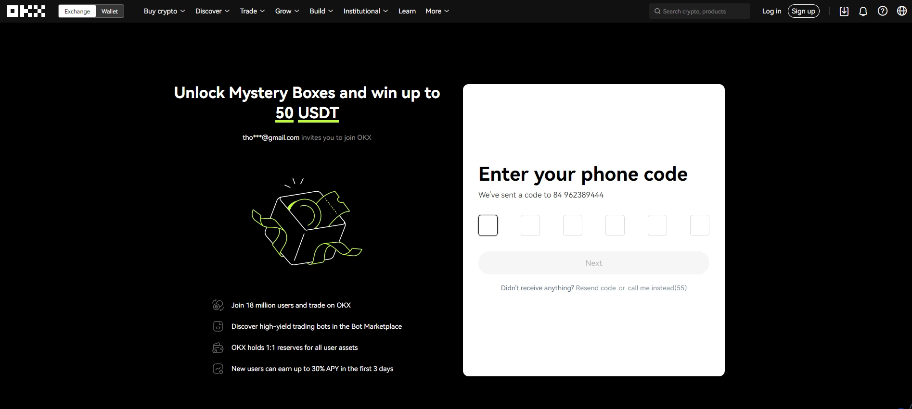

# What is OKX? Complete Guide to Registration and Trading on OKX Exchange

Founded in 2014 and headquartered in Hong Kong, OKX ranks as one of the world's top three cryptocurrency exchanges, providing financial services to traders globally. Backed by millions of dollars from venture capital funds including Giant Network Group, Longling Capital, and VenturesLab (co-founded by Tim Draper), OKX has established itself as a reliable platform for both beginners and professional traders seeking lower fees, diverse trading pairs, and robust security features.

---

## How to Register on OKX Exchange

Click [here](https://www.okx.com/join/62834398) to access the OKX homepage. Save this link to ensure you don't fall victim to phishing websites.

This will open a "Sign Up" window on your screen. Move your cursor to the "Email" field, click, and enter your email address.

If you register through [this link](https://www.okx.com/join/62834398), when you purchase 100 USDT or more of cryptocurrency in your first order, you'll receive 10 USDT in Bitcoin for free!

**Note:** You can register using either a phone number or email address. However, we recommend using email as the verification process tends to be faster.

Click the "Sign up" button, and the system will send a verification code to your registered email.

The system provides 60 seconds to retrieve and enter the code, then select "Next."

Next, you need to verify your phone number and select "Verify now."

The system will send a code to your registered phone number. Simply enter it and select "Next."

Then update your personal information.

Confirm that your registration information matches the information on your identity documents.

You'll be asked to create a secure password for your account. Remember to use a combination of numbers, letters, symbols, and both lowercase and uppercase text, choosing a phrase you find easy to remember.

Remember to keep your password secure and never share it with anyone, even those claiming to work for OKX.

## Account Verification (KYC) on OKX

OKX doesn't require you to verify all three levels. However, user withdrawal limits on the exchange are calculated according to account verification level. Specifically:

- Withdrawal limit for unverified KYC users: 0 BTC/day. This means if you don't verify your account, you won't be able to withdraw funds from the exchange.
- Withdrawal limit for Level 1 KYC users: 0.5 BTC/day.
- Withdrawal limit for Level 2 and 3 KYC users: 100 BTC/day.
- This limit may increase depending on your trading volume. If you have multiple sub-accounts, note that only one of them can be KYC verified.
- If you don't need to withdraw 100 BTC/day, you only need Level 1 verification – Basic verification. However, we recommend taking a bit more time to complete Level 2 KYC verification to ensure account security. This also increases your withdrawal limit for when you have high trading needs.

## KYC Guide on OKX

Go to the main page, click on the person icon, and select Verification.

In the verification frame, you'll have two options to verify: personal account or business account. Then select "Verify identity."

Select the type of identity document for verification: Driver's license/ID card/Passport.

The system will scan both sides of your chosen identity document and scan your face to verify that the information matches your registration information.

**Note:** Your Level 2 and 3 KYC applications need time to be reviewed. Please wait patiently for about an hour, your understanding and cooperation is appreciated. Please contact customer support if the time expires but you never receive a response from us.

## Guide to 2FA Authentication on OKX Exchange

### Securing OKX Exchange with Authenticator

These steps can be performed on either your phone or computer. We'll provide general instructions.

Access your OKX account, click on the person icon (account), then go to Security.

Select "Set up" at Authenticator App

Choose to activate the Authenticator App – If you don't have one yet, you can access the Apple Store or Google Play and search for the Google Authenticator app to download and install, or you can scan the QR code directly to download.

After downloading Google Authenticator, press the + button at the bottom right corner of the screen to add a code. Move your phone to the QR code at the bottom and it will scan the QR code and generate a 2FA code.

Note that this is an extremely important step. You need to save the QR code or "Setup key" for security, because if your phone encounters problems, you'll have trouble logging in. 👉 [Want to maximize your crypto trading security? Learn how OKX's advanced 2FA keeps your assets safe](https://www.okx.com/join/62834398)

Continue to receive the code on your phone and go to Authenticator to get the code to activate. Note that the code has only 6 digits and will be continuously changed.

You have now completed securing OKX exchange with Authenticator.

### 2FA Authentication on OKX Exchange

Select "Turn on" at the Two-factor authentication (2FA) section. You'll need to confirm with both SMS messages on your phone number and the Authenticator you scanned above.

You need to select "Send code" to receive the code on your phone, then select "Confirm."

## Guide to Depositing and Withdrawing Coins on OKX Exchange

Depositing and withdrawing coins on OKX exchange for trading is quite simple, but please pay attention to selecting the network carefully to avoid losing funds.

### How to Deposit Coins on OKX Exchange

At Assets => Select Deposit.

Select the coin/token you want to deposit to the exchange.

Select Chain => Next => Copy the wallet address or scan QR code.

### How to Withdraw Coins on OKX Exchange

At Assets => Select Withdraw.

Select the coin/token you want to withdraw => Select method => Select chain => Press Next.

Enter the address you want to withdraw to, then press Next.

## Guide to Trading on OKX Exchange

To start trading, you first need to transfer coins/tokens you've deposited from Funding account to Trading account.

Click on Assets => Select My assets => Press Transfer => Select token to transfer => Enter quantity => Press Transfer to complete.

On the main interface => Click on Trade => Select Spot to find the coin you want to trade.

Search for the coin/token you want to buy or sell and select the trading pair.

In the order panel, select the order type => Enter the amount of coin/token to buy or sell => Place Buy/Sell order.

After placing your order, it will appear in the Open orders section => Successfully executed buy/sell orders will appear in Order history.

## Simple Guide to Buying Coins on OKX

To get started, move your cursor to the "Buy crypto" section and select "P2P trading."

The screen will display many different sellers. Investors will choose someone with an appropriate selling price. The Limit/Available section means investors can only buy within the range set by the seller (for example, seller number 1's available range is 10,000,000 VND-183,210,480 VND).

Select "Buy" to start purchasing and enter the amount of USDT you want to buy. The screen will then display the VND amount corresponding to the USDT entered, and you select "Buy USDT with 0 fees" to continue.

The seller's payment information will appear on the screen. You just need to make the transfer (note you must complete it within 15 minutes) and select "Payment completed, next." Finally, select "Confirm" to complete the process.

  
## Guide to Selling Coins on OKX Exchange

To get started, move your cursor to the "Buy crypto" section and select "P2P trading."

The screen will display many different buyers. Investors will choose someone with an appropriate buying price. The Limit/Available section means you can only sell within the range set by the buyer (for example, buyer number 1's available range is 5,000,000 VND – 2,143,808,287 VND).

After selecting a buyer, click "Sell" and enter the amount of USDT you want to sell. **Note:** Here, investors should choose buyers with higher order numbers and completion rates. Then select the amount to sell and click "Sell USDT with 0 fees" to continue.

Note that after receiving notification that the buyer has transferred money, check your bank account carefully before releasing coins to avoid fraud.

---

## Conclusion

OKX stands out as a well-developed cryptocurrency exchange with comprehensive features that cater to both beginners and advanced traders. The platform offers more utilities for professional users compared to many other exchanges, while its low trading fees continue to attract users worldwide. With robust security measures, diverse trading pairs, and intuitive interfaces for spot trading and P2P transactions, [OKX provides an ideal environment for anyone looking to enter or expand their cryptocurrency trading journey](https://www.okx.com/join/62834398).
